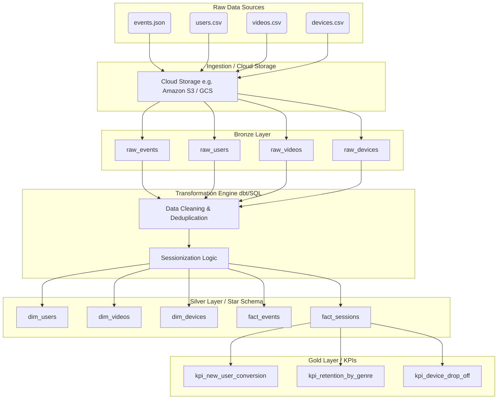

# StreamPro Data Flow & Architecture

We utilize a **Medallion Architecture** to process data from raw ingestion to reporting-ready KPIs. The following diagram illustrates this high-level data flow.

**Medallion Layers:**
*   **Raw Data Sources:** The raw output files from different application services.
*   **Ingestion / Cloud Storage:** The landing zone (Data Lake) where raw files are stored cheaply and immutably.
*   **Bronze (`streampro_bronze`):** Raw files loaded into the warehouse with a strict 1:1 mapping from source, providing a historical archive inside the database.
*   **Transformation Engine:** SQL or dbt models that clean data, cast data types, handle nulls, and execute business logic like constructing `session_id`.
*   **Silver (`streampro_silver`):** Query-optimized dimensional models (Star Schema) consisting of conformed dimensions and granular fact tables.
*   **Gold (`streampro_gold`):** Highly aggregated, business-level metric tables and KPIs ready to be directly visualized by BI dashboards (Tableau, Looker, etc.) without requiring complex joins.
