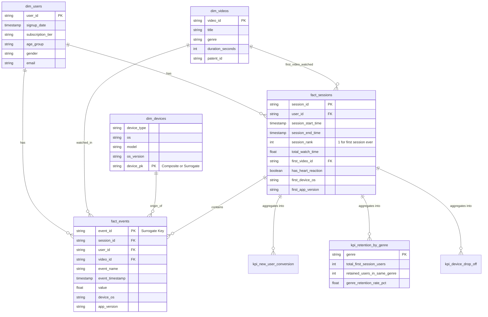

# StreamPro Data Model

We adopt a **Medallion Architecture (Bronze / Silver / Gold)**, centered around a **Star Schema** in the Silver layer to easily support session-level analytics. 

**Key Design Decisions:**
1.  **Medallion Architecture:**
    *   **Bronze (`streampro_bronze`):** Raw, unmodified data ingested directly from `.csv` and `.json` files.
    *   **Silver (`streampro_silver`):** Cleaned, conformed dimensions (`dim_users`, `dim_videos`) and facts (`fact_events`, `fact_sessions`) that form the Star Schema.
    *   **Gold (`streampro_gold`):** Highly aggregated, business-level metric tables (e.g., `kpi_retention_by_genre`) ready for direct ingestion by BI dashboards.
2.  **`fact_sessions` Table:** To easily answer questions about sessions (drop-off, watch time per session, first session conversions), we heavily rely on aggregating events into a `fact_sessions` table in the Silver layer. This avoids complex window functions and self-joins in downstream analytical queries.
3.  **Genre Retention Logic:** As captured in `streampro_gold.kpi_retention_by_genre`, a user is only considered "retained" by a genre if they watch that *same exact genre* again during their second session within a 72-hour window.
